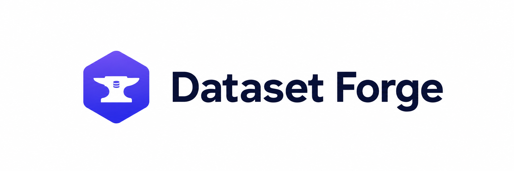

<p align="center">
  
</p>

# Dataset Forge

> Turn documents into validated, source-grounded AI datasets.

   

Dataset Forge is a local, single-page document-to-dataset application. It transforms one PDF, DOCX, or TXT document into a packaged AI dataset using Docling extraction, RunPod Serverless, vLLM, and `openai/gpt-oss-20b`. V1 is **PoC release ready**—it is not a hosted SaaS or production-certified service.

## What Dataset Forge V1 does

1. Upload one PDF, DOCX, or TXT document.
2. Extract and normalize it: Docling for PDF/DOCX, direct UTF-8/CP1252 extraction for TXT.
3. Analyze the document structure and accept a natural-language dataset request.
4. Plan bounded generation batches and generate structured records through RunPod Serverless, vLLM, and `openai/gpt-oss-20b`.
5. Author the canonical dataset as structured JSON, then validate schema, source references, evidence, grounding, duplicates, and quality.
6. Run one bounded, advisory AI quality review; at most one model-authored revision is allowed globally.
7. Export JSON or a deterministic CSV derived from the accepted canonical JSON, then download a ZIP package.

## Design principles

- Canonical JSON is the source of truth; CSV is never separately AI-generated.
- A provider completion is not a validation success. Every final record needs verified evidence from the uploaded source.
- Batch-local source aliases are canonicalized before global assembly, preventing cross-batch provenance leaks.
- Deterministic validation is authoritative; the AI reviewer is advisory.
- No chain-of-thought is stored, and production generation has no placeholder fallback.

## Architecture

```text
Document
  -> Docling / TXT extractor
  -> Canonical extraction + generation planner
  -> RunPod Serverless
  -> vLLM Chat Completions + gpt-oss-20b
  -> Canonical Dataset JSON
  -> Schema + evidence + grounding validation
  -> Bounded AI quality review
  -> JSON / deterministic CSV + ZIP package
```

## Technology

| Area | Stack |
| --- | --- |
| Frontend | React, TypeScript, Vite, Tailwind CSS, Lucide |
| Backend | Python, FastAPI, Pydantic, Docling |
| AI | RunPod Serverless, vLLM Chat Completions, `openai/gpt-oss-20b` |
| Testing | pytest, Vitest, Playwright acceptance coverage |

## Run locally

Prerequisites: Python 3.11 (the existing project setup), Node.js with npm, and your own RunPod Serverless endpoint backed by a compatible vLLM worker. The provider credential stays on the backend.

Clone the repository, then set up the backend:

```powershell
cd backend
py -3.11 -m venv .venv
.\.venv\Scripts\Activate.ps1
pip install -r requirements.txt
Copy-Item .env.example .env
```

Set your own values in `backend/.env`—never commit this file:

```dotenv
APP_ENVIRONMENT=development
FRONTEND_ORIGIN=http://localhost:5173
MAX_UPLOAD_SIZE=26214400
OUTPUT_DIRECTORY=app/outputs
TEMP_UPLOAD_DIRECTORY=app/uploads
RUNPOD_ENDPOINT_ID=YOUR_RUNPOD_ENDPOINT_ID
RUNPOD_API_KEY=YOUR_RUNPOD_API_KEY_HERE
RUNPOD_MODEL=openai/gpt-oss-20b
RUNPOD_MAX_MODEL_LEN=YOUR_CONFIGURED_MAX_MODEL_LEN
QUALITY_VALIDATOR_MODE=same_model
PUBLIC_RESEARCH_ENABLED=false
RUNPOD_POLL_INTERVAL_SECONDS=1
RUNPOD_QUEUE_TIMEOUT_SECONDS=300
RUNPOD_EXECUTION_TIMEOUT_SECONDS=600
RUNPOD_RECORDS_PER_BATCH=4
MAX_DATASET_RECORDS=20
```

Start the backend:

```powershell
python -m uvicorn app.main:app --host 127.0.0.1 --port 8000
```

In another terminal, start the frontend:

```powershell
cd frontend
npm install
Copy-Item .env.example .env
npm run dev -- --host 127.0.0.1 --port 5173
```

Open `http://127.0.0.1:5173`. FastAPI documentation is available at `http://127.0.0.1:8000/docs`.

## Use the app

Upload a document, describe the dataset you want, select JSON or CSV, and generate. Follow extraction, generation, validation, and review progress in the UI; inspect the resulting metrics; then download the ZIP.

## Output package

```text
dataset-forge-output.zip
├── dataset.json (or dataset.csv)
├── metadata.json
├── validation-report.json
├── quality-review.json
├── README.txt
├── manifest.json
└── generation_manifest.json
```

### Grounding and batching

Dataset Forge verifies evidence excerpts against the exact extracted source units provided during generation and requires every accepted record to satisfy the source/evidence grounding contract. This validates grounding to the uploaded document; it is not universal external fact-checking.

Large documents are partitioned into bounded batches. Provider-visible, batch-local aliases are resolved to canonical extraction IDs before assembly, so provenance remains safe across batches.

## Security, privacy, and limitations

Your RunPod key remains backend-only, and `.env` is ignored. When bounded extracted context is enough, original binaries are not sent wholesale. No chain-of-thought is persisted and public research is disabled by default. Every clone must use its own RunPod credentials.

V1 accepts one source document per generation and has no authentication, account history, durable job database, distributed queue, or high-availability deployment. Jobs are process-local, one provider/model is configured, and scanned-only PDF OCR support is limited. This is a PoC release-ready application, not a production-certified service.

## Tests

```powershell
cd backend
python -m pytest -q
cd ..\frontend
npm test
npm run typecheck
npm run build
```

The deterministic suite uses mocked provider transport and does not make real RunPod calls by default. Final release verification: backend **65 passed** (4 Docling deprecation warnings); frontend **3 passed**, typecheck and production build passed. Details are recorded in the [publication record](docs/engineering/V1-GITHUB-PUBLICATION.md).

## Engineering history

- [Implementation log](docs/engineering/IMPLEMENTATION-LOG.md)
- [Phase 2: Docling extraction](docs/engineering/PHASE-2-DOCLING-EXTRACTION.md)
- [Phase 3: RunPod generation](docs/engineering/PHASE-3-RUNPOD-GPT-OSS-GENERATION.md)
- [Phase 4: grounding and validation](docs/engineering/PHASE-4-GROUNDING-VALIDATION-QUALITY.md)
- [Phase 5: bounded quality review](docs/engineering/PHASE-5-AGENTIC-QUALITY-REVIEW.md)
- [Phase 6: final hardening acceptance](docs/engineering/PHASE-6-FINAL-HARDENING-ACCEPTANCE.md)

## License

Dataset Forge is source-available under the [Dataset Forge Community License 1.0](LICENSE). Personal, educational, research, nonprofit, and qualifying small-business use is permitted. Organizations with combined annual gross revenue of US $250,000 or more need a commercial license. See [commercial licensing](COMMERCIAL-LICENSE.md).

The Dataset Forge name and logo are project branding; this license does not grant trademark rights.

## Commercial licensing

Organizations outside the Community License's permitted-use limits can contact the repository owner through GitHub Issues or Discussions for commercial licensing. Do not post security vulnerabilities or credentials in public issues; see [SECURITY.md](SECURITY.md).
